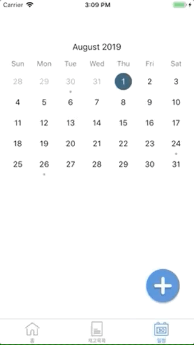

# JaegoJaego

식당의 효율적인 음식 재고 관리와 일정을 관리하는 어플

식당을 운영하느라 확인하기 어려운 재료 상태와 로스 관리를 위해 제작되었습니다. 
식품의 유통기한을 미리 알았더라면 버리지 않았을 재료들... 남은 재고들을 날짜별로 확인하세요.

유통기한에 따른 재고표시로 더욱 편리해진 로스관리와 재료주문이 가능합니다.

#

### 홈
입고목록과 출고목록을 확인하는 창

   

#

### 재고 목록
보관하고 있는 재고와 폐기목록, 당일마감, 양호 목록을 보여주는 창

#

### 재고 일정 창 
> 예약과 입고 및 출고 등을 기록할 수 있는 재고 일정 창
>> (updating..)

#

### ✨ Developer & Designer ✨
- 정보보호학과 성다연
- 디지털미디어학과 정유림
- 디지털미디어학과 이유진
